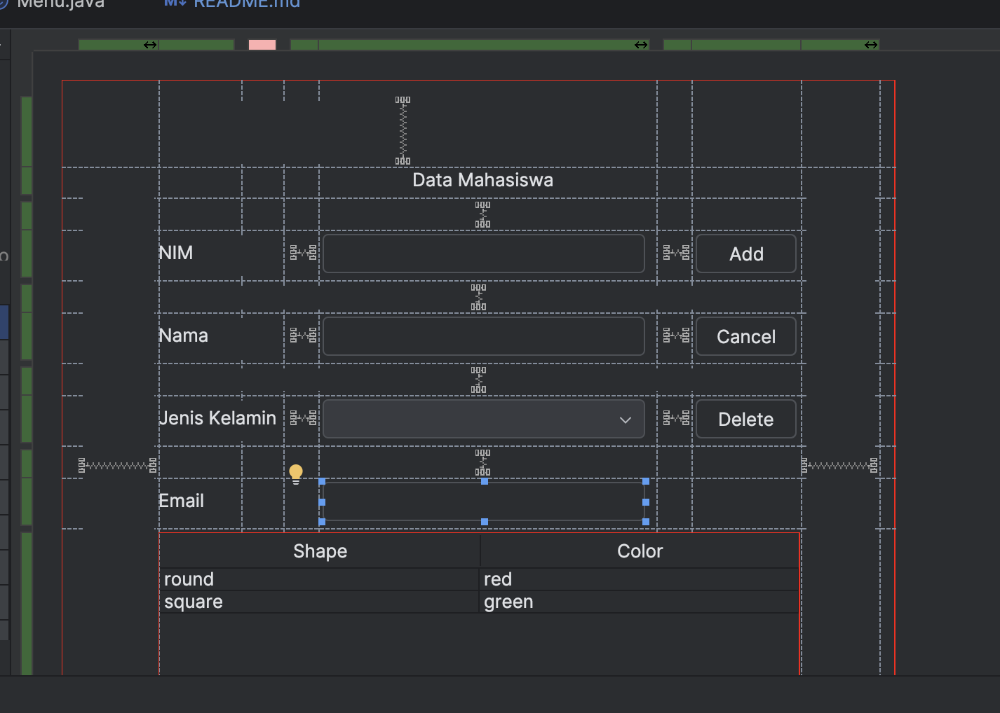
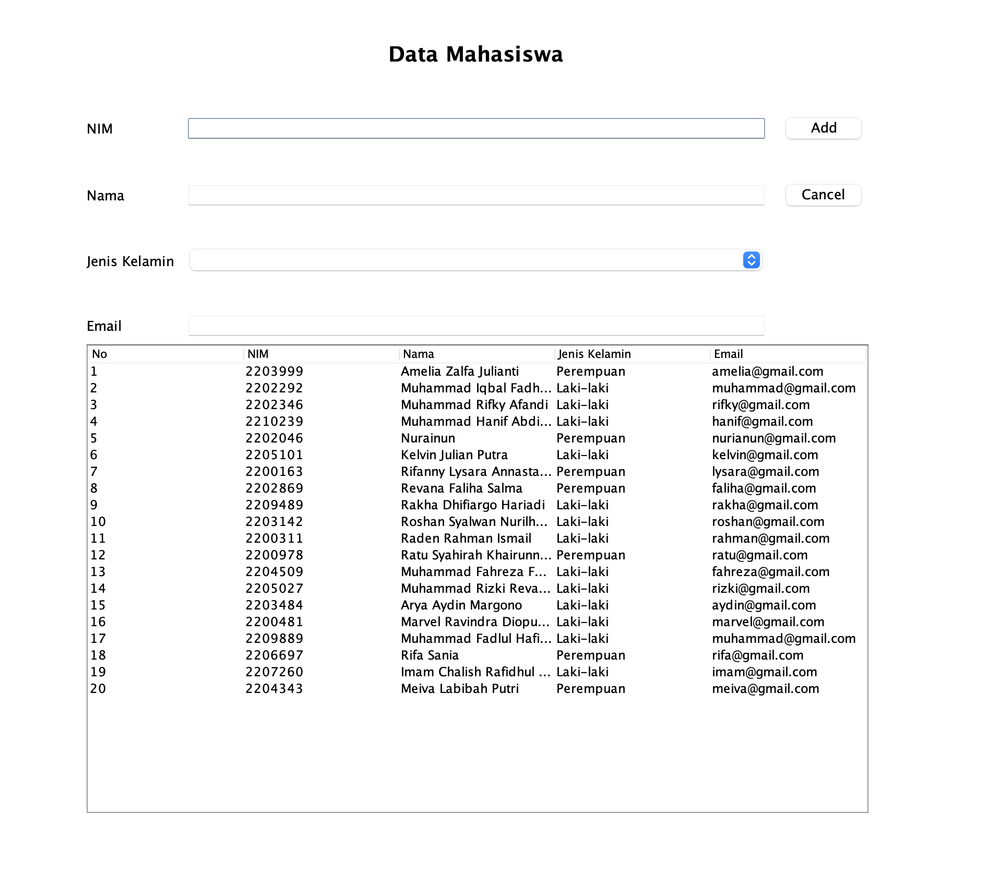

## Janji
Saya Yahyo Abdullozoda dengan NIM 2313368 mengerjakan soal Tugas Praktikum 4
dalam mata kuliah DPBO untuk keberkahanNya maka saya tidak melakukan kecurangan
seperti yang telah dispesifikasikan. Aamiin!!!

## Desain Program

Program merupakan form “Data Mahasiswa” yang mengimplementasikan CRUD.
Program terdiri dari 2 class yaitu class Mahasiswa dan class Menu. Dengan detail berikut:

## 1. Class Mahasiswa

Class ini merepresentasikan data mahasiswa, dengan atribut berikut:
•	NIM → Nomor Induk Mahasiswa
•	Nama → Nama mahasiswa
•	Jenis Kelamin → Jenis kelamin mahasiswa
•	Email → Email mahasiswa

Di dalam class Mahasiswa berisikan method getter dan setter dari masing-masing atribut.

## 2. Class Menu

Class ini bertanggung jawab untuk tampilan dan interaksi pengguna dengan aplikasi. Class ini menggunakan Java Swing untuk membuat GUI (Graphical User Interface).

# Komponen dalam Class Menu:
•	Panel Utama (JPanel) → Menampung semua elemen UI.
•	Tabel Mahasiswa (JTable) → Menampilkan daftar mahasiswa.
•	Form Input (JTextField, JComboBox) → Digunakan untuk mengisi dan mengedit data mahasiswa.
•	Tombol Aksi (JButton):
•	Add/Update → Menambahkan atau memperbarui data mahasiswa.
•	Delete → Menghapus data mahasiswa.
•	Cancel → Membersihkan form input.

# Method-Method dalam Class Menu:
•	insertData() → Menambahkan data mahasiswa ke dalam list dan memperbarui tabel.
•	updateData() → Memperbarui data mahasiswa yang dipilih.
•	deleteData() → Menghapus data mahasiswa dari list.
•	clearForm() → Mengosongkan semua input form.
•	setTable() → Mengatur tampilan tabel berdasarkan data yang ada.
•	populateList() → Mengisi daftar mahasiswa dengan data awal.

## 3. Desain Program

## 4. Hasil Terakhir
